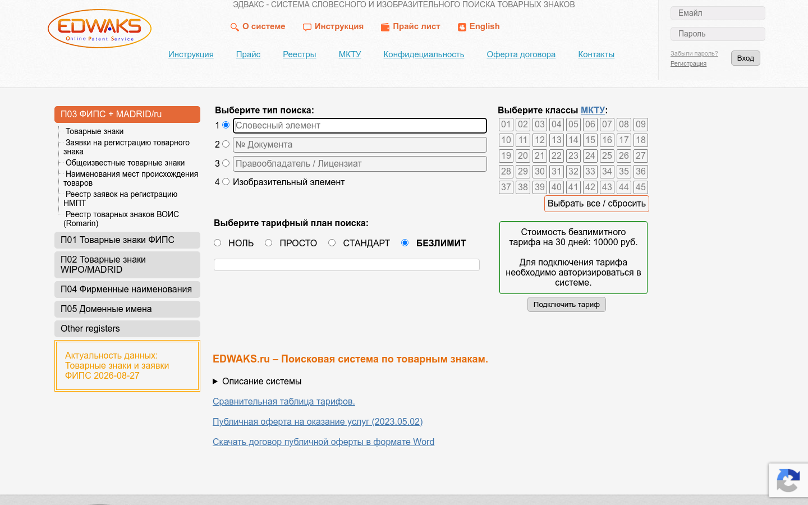
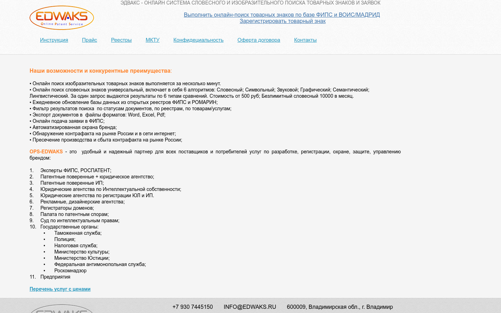
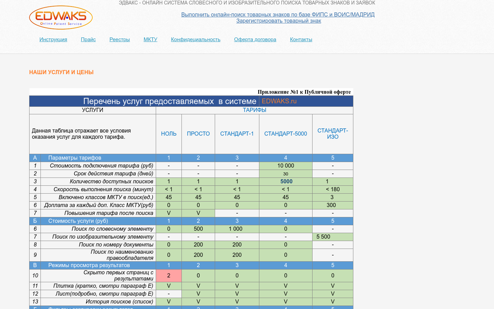
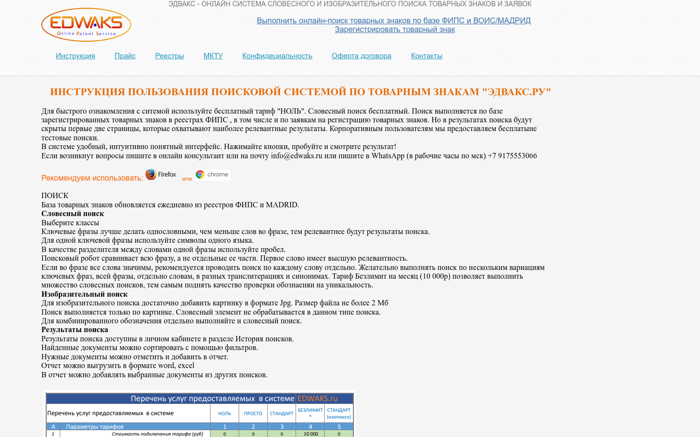

# Edwaks: Trademark Search

> English version of [README.md](README.md).

> **To purchase this software, contact: itshumakher@ g m a il.com**

**Edwaks: Trademark Search** is a public trademark-search assistant. It is designed for entrepreneurs, brand creators, and intellectual-property specialists and supports an initial name check using FIPS and WIPO data.

- Public URL: https://edwaks.ru/ops/search
- Core entities: marks, search queries, classes, results, reference materials, and pricing plans.
- Key capabilities: search form, match review, class navigation, fips and wipo sources, help information, pricing description, preparation for expert review.

## Why the Product Is Needed

A real workflow rarely consists of a single action. Users must understand the initial situation, gather information, choose the next step, coordinate a decision, and return to the result later. Edwaks: Trademark Search provides one domain-specific environment for this work. It preserves context between stages and shows not only an individual item, but also its place in the overall process.

The product’s main value is not the number of screens, but workflow continuity. Marks, search queries, classes, results, reference materials, and pricing plans are treated as parts of one user journey. New participants understand the current state faster, experienced specialists spend less time matching information manually, and managers gain a clear overview without requiring every step to be retold.

## What the User Gets

### A Clear Entry Point

The first screen explains the service, helps users find the relevant section, and lets them resume unfinished work. Terms reflect the subject area, while primary actions are grouped by user goal. No knowledge of the product’s internal architecture is required.

### A Consistent Workflow

The user moves from an overview to a specific object, then to an action and verification of its result. Related information remains nearby: users can see where a task came from, who is involved, what has already been done, and what outcome is expected. This approach supports both one-off operations and recurring processes.

### Observable State

Statuses, lists, and cards answer practical questions: what is available now, what needs attention, where a decision is pending, and what is complete. Visibility reduces dependence on verbal clarification and scattered notes. It does not replace professional judgment, but gives that judgment a reliable basis.

### Shared Language for Participants

The roles Entrepreneur, Marketer, and Patent specialist work with the same domain model from different perspectives. Consistent names for objects and states reduce ambiguity during handoffs. A responsible participant can reference a specific object and expected result instead of repeating the entire context.

## Main Sections

The public description covers these user capabilities:

- **Search form** — a distinct part of the workflow, connected to the product model and a clear user outcome.
- **Match review** — a distinct part of the workflow, connected to the product model and a clear user outcome.
- **Class navigation** — a distinct part of the workflow, connected to the product model and a clear user outcome.
- **FIPS and WIPO sources** — a distinct part of the workflow, connected to the product model and a clear user outcome.
- **Help information** — a distinct part of the workflow, connected to the product model and a clear user outcome.
- **Pricing description** — a distinct part of the workflow, connected to the product model and a clear user outcome.
- **Preparation for expert review** — a distinct part of the workflow, connected to the product model and a clear user outcome.

Detailed explanations of sections, roles, and end-to-end flows are available in the “Features” document. Practical situations are collected in “Use Cases,” and brief answers are provided in the FAQ.

## Intended Users

### Entrepreneur

Gets a quick overview, starts the primary scenario, and sees the result in terms of the task. Clear navigation, predictable states, and the ability to resume earlier work are essential for this role.
### Marketer

Works with domain details, clarifies information, and moves an object through the process. The interface preserves context and distinguishes factual data from an interim decision.
### Patent specialist

Focuses on completeness, consistency, and the final outcome. This role can review, prioritize, and hand work to the next participant without interacting with hidden technical mechanisms.

## User Experience Principles

1. **Domain focus.** Screens use concepts from the real task rather than the internal software architecture.
2. **Continuity.** Cards, lists, and statuses form a workflow instead of a set of disconnected pages.
3. **Verifiability.** After a meaningful action, users see a changed state or an explicit result.
4. **Role focus.** Each role starts with the information needed for its next decision.
5. **Explicit waiting.** When a result depends on another participant, the interface displays that dependency as a separate state.
6. **Honest boundaries.** Public documentation does not promise capabilities that cannot be confirmed from the product’s purpose.

## Getting Started

1. Open the public URL and review the product’s purpose.
2. Identify your role and the domain object you will work with.
3. Move from the general overview to the relevant section.
4. Check the initial information and available actions.
5. Complete one end-to-end scenario and verify that the result appears in the object’s state.
6. Use the repository’s detailed materials to explore the remaining capabilities.

## Scope of the Public Description

This repository describes the product from the user’s perspective: tasks, roles, screens, concepts, and expected results. It is not an operations manual, legal opinion, or promise that the interface will remain unchanged. Available actions may depend on the role, product edition, and conditions of a particular deployment.

## Additional Materials

- [Features (detailed)](docs/FEATURES.md)
- [Use Cases](docs/USE_CASES.md)
- [FAQ](docs/FAQ.md)
- [Product Profile](docs/DATASET.md)

## Interface Screenshots

### Search

### About

### Price

### Help

---

## Public Disclaimer

This repository contains **only user-facing and marketing documentation** for the product.  
Source code, keys, infrastructure configurations, proxies, anti-blocking policies, and internal procedures **are not published**.

© AiSaray / Edwaks, 2026
